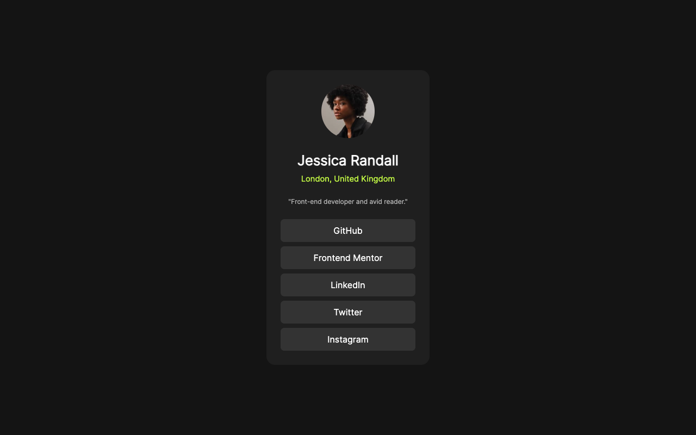
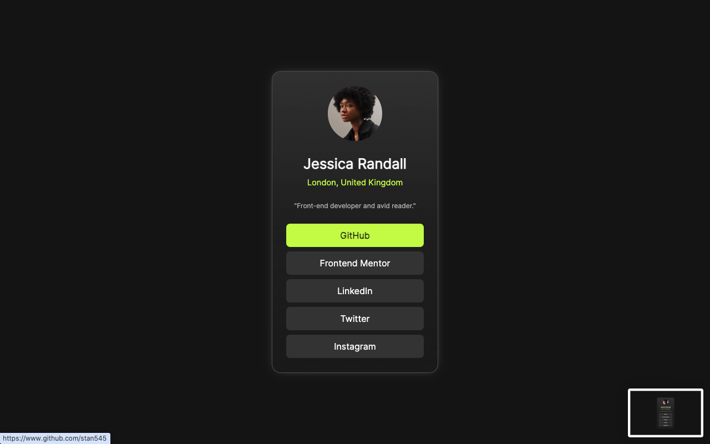
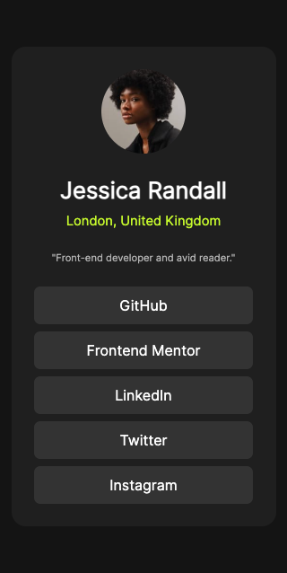

# Frontend Mentor - Social links profile solution

This is a solution to the [Social links profile challenge on Frontend Mentor](https://www.frontendmentor.io/challenges/social-links-profile-UG32l9m6dQ). Frontend Mentor challenges help you improve your coding skills by building realistic projects. 

## Table of contents

- [Overview](#overview)
  - [The challenge](#the-challenge)
  - [Screenshot](#screenshot)
  - [Links](#links)
- [My process](#my-process)
  - [Built with](#built-with)
  - [What I learned](#what-i-learned)
  - [Continued development](#continued-development)
  - [Useful resources](#useful-resources)
- [Author](#author)
- [Acknowledgments](#acknowledgments)

## Overview

### The challenge

Users should be able to:

- View a profile card containing the user's name, location, and bio
- Click on various social media links
- See hover and focus states for all interactive elements on the page

### Screenshot
Desktop view

Active State


Mobile View


### Links

- Solution URL: [View code here](https://github.com/stan545/social-links-profile.git)
- Live Site URL: [Preview site](https://social-links-profile-delta-lake.vercel.app/)

## My process

### Built with

- Semantic HTML5 markup
- CSS custom properties
- Flexbox
- CSS Grid
- Mobile-first workflow
- Custom Fonts with ``@font-face``
- Responsive Design with Media Queries


### What I learned

During this project, I strengthened my understanding of:

- Building responsive layouts with Flexbox
- Using CSS variables for maintainable and scalable design
- Importing and applying custom fonts with ``@font-face``
- Enhancing accessibility and interactivity with focus states and ``tabindex``

```html
<main class="flexCol">
  <div class="wrapper">...</div>
</main>
```
```css
:root {
  --green: hsl(75, 94%, 57%);
  --dark-grey: hsl(0, 0%, 12%);
}

.flexCol {
  display: flex;
  flex-direction: column;
  align-items: center;
}
```

### Continued Development

In future projects, I want to focus more on:

- Improving accessibility by learning more about semantic roles, ARIA labels, and keyboard navigation.
- Enhancing animations and transitions for smoother user experiences using only CSS.
- Practicing component-based design using frameworks like React after mastering more static projects.
- Refining my use of responsive design techniques, especially for complex layouts and larger screen sizes.


### Useful Resources

- [CSS-Tricks: A Complete Guide to Flexbox](https://css-tricks.com/snippets/css/a-guide-to-flexbox/)
- [MDN Docs: CSS Custom Properties](https://developer.mozilla.org/en-US/docs/Web/CSS/--*)
- [MDN Docs: @font-face](https://developer.mozilla.org/en-US/docs/Web/CSS/@font-face)


## Author

- GitHub - [@stan545](https://github.com/stan545)
- Frontend Mentor - [@stan545](https://www.frontendmentor.io/profile/stan545)
- Twitter - [@stanhenry4](https://www.twitter.com/stanhenry4)

